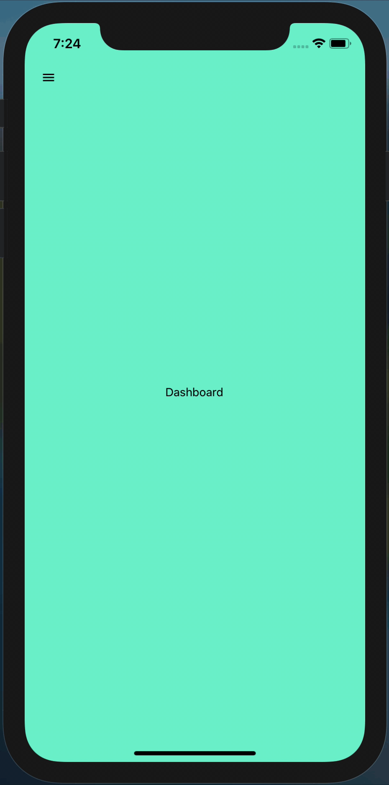

  <a href="#rocket-tecnologias">Tecnologias</a>&nbsp;&nbsp;&nbsp;|&nbsp;&nbsp;&nbsp;
  <a href="#-como-excutar">Como excutar</a>

 

  

## :rocket: Tecnologias

Esse projeto foi desenvolvido com a finalidade apenas para estudos de animações feitas com a tecnologia:

- [React Native](https://facebook.github.io/react-native/)

## 🤔 Como excutar

- Faça o clone ou download do projeto;
- Acesse a pasta raiz do projeto e execute: `npm i` ou `yarn`;
- Após isso rode: `react-native run-ios` ou `react-native run-android` para rodar o projeto;

Feito com ♥ e ☕ by Lucas Krul 